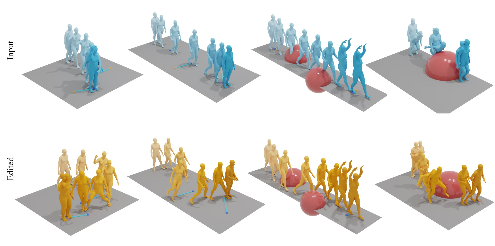
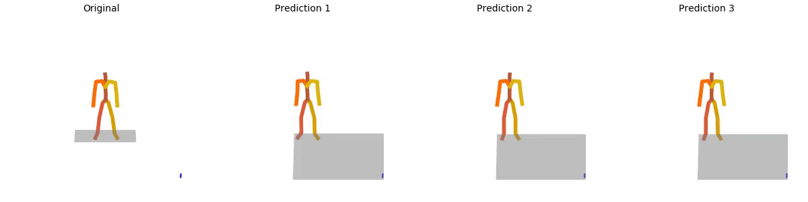
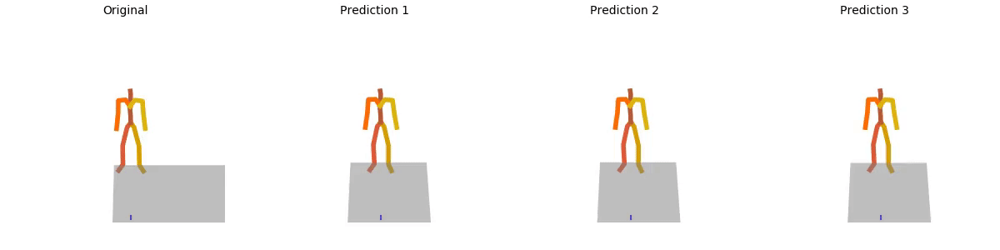
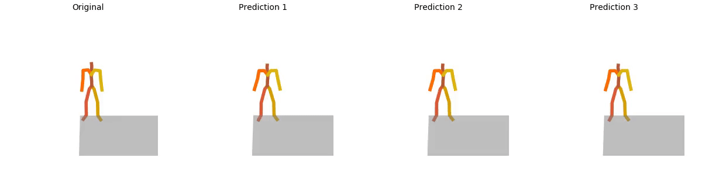
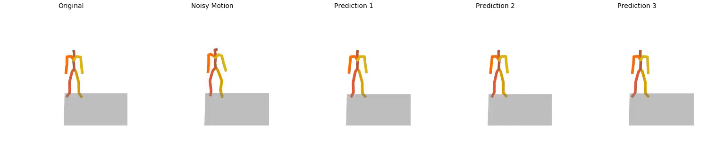
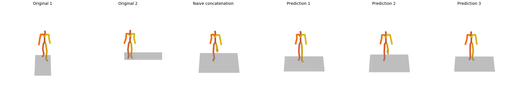
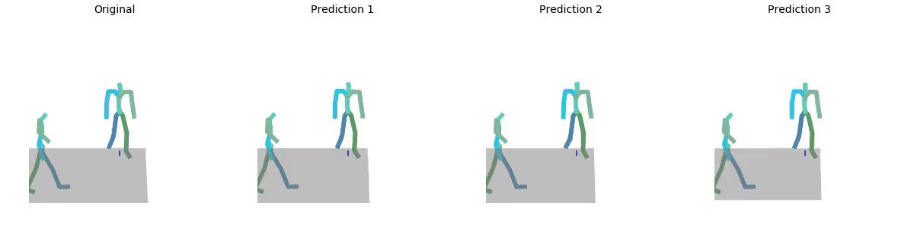
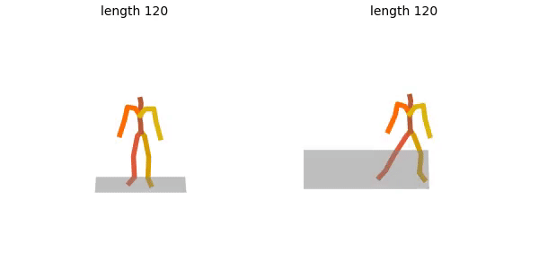
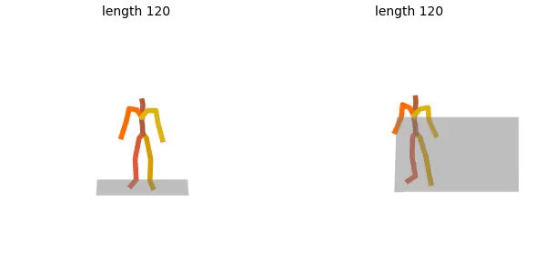

# Diffusion-Noise-Optimization

DNO: Optimizing Diffusion Noise Can Serve As Universal Motion Priors

[](https://arxiv.org/abs/2312.11994)

The official PyTorch implementation of the paper [**"DNO: Optimizing Diffusion Noise Can Serve As Universal Motion Priors"**](https://arxiv.org/abs/2312.11994).

Visit our [**project page**](https://korrawe.github.io/dno-project/) for more details.




#### Bibtex
If you find this code useful in your research, please cite:

```
@inproceedings{karunratanakul2023dno,
  title     = {Optimizing Diffusion Noise Can Serve As Universal Motion Priors},
  author    = {Karunratanakul, Korrawe and Preechakul, Konpat and Aksan, Emre and Beeler, Thabo and Suwajanakorn, Supasorn and Tang, Siyu},
  booktitle = {arxiv:2312.11994},
  year      = {2023}
}
```

## News

📢 **13/June/24** - Full code release with demo.

📢 **9/May/24** - Initial release with functional generation and evaluation code.


## Getting started

**Important**: DNO is model agnostic and can be used with any diffusion model. The main file is `dno.py`. The demo code for different tasks is in `sample/gen_dno.py`.

This demo will show the result using MDM with Exponential Model Averaging (EMA) which we trained ourselves.


The environment setup is the same as [GMD](https://github.com/korrawe/guided-motion-diffusion). If you already have a working environment, it should also work here.

This code was tested on `Ubuntu 20.04 LTS` and requires:

* Python 3.7
* conda3 or miniconda3
* CUDA capable GPU (one is enough)

### 1. Setup environment

Install ffmpeg (if not already installed):

```shell
sudo apt update
sudo apt install ffmpeg
```
For windows use [this](https://www.geeksforgeeks.org/how-to-install-ffmpeg-on-windows/) instead.


### 2. Install dependencies

DNO uses the same dependencies as GMD so if you already install one, you can use the same environment here.

Setup conda env:

```shell
conda env create -f environment_gmd.yml
conda activate gmd
conda remove --force ffmpeg
python -m spacy download en_core_web_sm
pip install git+https://github.com/openai/CLIP.git
```

Download dependencies:


<summary><b>Text to Motion</b></summary>

```bash
bash prepare/download_smpl_files.sh
bash prepare/download_glove.sh
bash prepare/download_t2m_evaluators.sh
```


### 2. Get data

<!-- <details>
  <summary><b>Text to Motion</b></summary> -->

There are two paths to get the data:

(a) **Generation only** wtih pretrained text-to-motion model without training or evaluating

(b) **Get full data** to train and evaluate the model.


#### a. Generation only (text only)

**HumanML3D** - Clone [HumanML3D](https://github.com/EricGuo5513/HumanML3D.git), then copy the data dir to our repository:

```shell
cd ..
git clone https://github.com/EricGuo5513/HumanML3D.git
unzip ./HumanML3D/HumanML3D/texts.zip -d ./HumanML3D/HumanML3D/
cp -r HumanML3D/HumanML3D Diffusion-Noise-Optimization/dataset/HumanML3D
cd Diffusion-Noise-Optimization
```


#### b. Full data (text + motion capture)


**HumanML3D** - Follow the instructions in [HumanML3D](https://github.com/EricGuo5513/HumanML3D.git),
then copy the result dataset to our repository:


Then copy the data to our repository
```shell
cp -r ../HumanML3D/HumanML3D ./dataset/HumanML3D
```

### 3. Download the pretrained models

Download our version of MDM, then unzip and place it in `./save/`. 
The model is trained on the HumanML3D dataset.

[MDM model with EMA](https://polybox.ethz.ch/index.php/s/ZiXkIzdIsspK2Lt)


## Motion Synthesis
We provide a demo code for **motion editing, in-filling (and in-beetweening), refinement, and blending tasks** in `sample/gen_dno.py`. The task can be selected by commenting or uncommenting from list on lines 54-58. The dense optimization task can be used for debugging and testing the optimization process.


**Note**: The only differences between these tasks are the reward/loss function and whether to start from DDIM inverted noise or random noise. The rest of the framework is the same.

The demo targets are currently hardcoded in `sample/dno_helper.py` and can be modified to your own target (e.g. our own reward function or hardcoded target pose/locations). 
In all tasks, the target pose and the mask need to be specified.

```shell
python -m sample.gen_dno --model_path ./save/mdm_avg_dno/model000500000_avg.pt --text_prompt "a person is jumping"
```

We can specify the initial motion by adding `--load_from` to the command. The initial motion must be in the same format as the target motion.

```shell
python -m sample.gen_dno --model_path ./save/mdm_avg_dno/model000500000_avg.pt --text_prompt "a person is jumping" --load_from ./save/mdm_avg_dno/samples_000500000_avg_seed20_a_person_is_jumping/trajectory_editing_dno_ref
```

#### Addional options:
- You can use `--seed` to specify the seed for the random noise and generation.

### Motion Editing
For motion editing there is a UI for trajectory editing that can be used with the flag `USE_GUI` as follows: 
- Slide the bar to select frame.
- Click the location you want to edit to.
- Click add.
- Repeat until you are satisfy then click done.

#### Content-preserved Editing
Target location at 90th frame, motion length 120 frames:



#### Chained Editing
New target at 40th frame, start from previous output motion:



#### Pose Editing
Lower head location at 90th frame:



**Note**: For editing, we need an inverted noise to start from. We use DDIM inversion on the input motion to get the inverted noise, however, this process is an approximation. If available, we can use the final noise from the previous optimization to avoid the approximation.

### Motion Refinement
Starting from noisy version of the above motion:



### Motion Blending
"a person is walking forward" and "a person is jumping sideway":


### Motion Inbeetweening
Original motion generated with "a person is walking slightly to the left":



## Useful Notes
- We use 500-800 iterations for the optimization with 10 DDIM steps. The number of iterations can be adjusted with the `num_opt_steps` in `DNOOption` and `num_ode_steps` in `gen_dno.py`.
- More iterations can lead to better results but also longer computation time. DDIM steps can be increased as well.
- We found that more DDIM steps require more iterations to converge (1000-2000 steps) but generally produce better results.
- DDIM inversion step can be reduced to 100 steps and it will still work well in most case. For chained editing, we need more accurate inverted noise so we recommend using 1000 steps. The more edits we made, the farther we are from the learned distribution so we need more accurate inverted noise.


## Visualization

**Running the generation command will get you:**

* `results.npy` file with text prompts and xyz positions of the generated animation
* `sample00_rep##.mp4` - a stick figure animation for each generated motion. `rep00` is always the original motion.

**To create SMPL mesh per frame run:**

```shell
python -m visualize.render_mesh --input_path /path/to/mp4/stick/figure/file
```

**This script outputs:**
* `sample##_rep##_smpl_params.npy` - SMPL parameters (thetas, root translations, vertices and faces)
* `sample##_rep##_obj` - Mesh per frame in `.obj` format.


**Notes:**
* The `.obj` can be integrated into Blender/Maya/3DS-MAX and rendered using them.
* This script is running [SMPLify](https://smplify.is.tue.mpg.de/) and needs GPU as well (can be specified with the `--device` flag).
* **Important** - Do not change the original `.mp4` path before running the script.
* You have two ways to animate the sequence:
  1. Use the [SMPL add-on](https://smpl.is.tue.mpg.de/index.html) and the theta parameters saved to `sample##_rep##_smpl_params.npy` (we always use beta=0 and the gender-neutral model).
  2. A more straightforward way is using the mesh data itself. All meshes have the same topology (SMPL), so you just need to keyframe vertex locations. 
     Since the OBJs are not preserving vertices order, we also save this data to the `sample##_rep##_smpl_params.npy` file for your convenience.

**For automatic rendering with Blender:**
* To render the full-body animation (like in our teaser figure and the video), we refer the user to the rendering script of [TEMOS](https://github.com/Mathux/TEMOS) under *Rendering motions*.
* The script can take the resulting `sample##_rep##_smpl_params.npy` from SMPL fitting command above and render the full-body animation.


## Evaluation
### Motion Refinement
The script will evaluate the model on the HumanML3D dataset by adding noise to the ground truth motion. This will produce the *DNO-MDM* results in Table 2 of our paper.
```shell
python -m eval.eval_refinement --model_path ./save/mdm_avg_dno/model000500000_avg.pt
```
The generation can be sped up by incresing the batch size in the `evaluation()` function at the cost of GPU memory.

### Motion Editing
The script will generate motions from the given text prompt and randomly change a location in a single frame to a new location. This will produce the *DNO-MDM* results in Table 1 of our paper.
```shell
python -m eval.eval_edit --model_path ./save/mdm_avg_dno/model000500000_avg.pt --text_prompt "a person is jumping" --seed 10
```
We used the following text prompts for the evaluation in our paper, mainly because of its ease of defining whether the content is preserved: "a person is walking with raised hands", "a person is jumping", 
    "a person is crawling", "a person is doing a long jump"






## Acknowledgments

Our code is built upon many prior projects and would like to thank the following contributors for the great foundation:

[GMD](https://github.com/korrawe/guided-motion-diffusion),
[MDM](https://github.com/GuyTevet/motion-diffusion-model), [guided-diffusion](https://github.com/openai/guided-diffusion), [MotionCLIP](https://github.com/GuyTevet/MotionCLIP), [text-to-motion](https://github.com/EricGuo5513/text-to-motion), [actor](https://github.com/Mathux/ACTOR), [joints2smpl](https://github.com/wangsen1312/joints2smpl), [MoDi](https://github.com/sigal-raab/MoDi).

## License
This code is distributed under an [MIT LICENSE](LICENSE).

Note that our code depends on other libraries, including CLIP, SMPL, SMPL-X, PyTorch3D, and uses datasets that each have their own respective licenses that must also be followed.
Gugus
